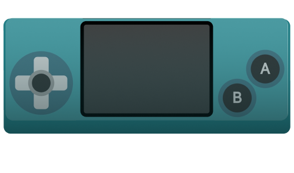

# Arcade Server

The Frontend for the [CMGT Arcade Machine](https://hr-cmgt.github.io/arcade-server/)


## NWJS

The DOCS folder of this repository will be [served](https://hr-cmgt.github.io/arcade-server/) on the arcade cabinet at CMGT. The browser is [NWJS](http://docs.nwjs.io/en/latest/For%20Users/Getting%20Started/#get-nwjs) in Kiosk Mode.

Student games are also github repositories or other urls where their game is served.

The NWJS shortcut CTRL+A will always redirect from any game back to the main page. The NWJS folder of this repo contains the package.json and index.js files for NWJS. These files have to be placed on the actual arcade machine, with the Linux version of [NWJS](https://nwjs.io/downloads/).

## Game requirements

[Check the Arcade Game repository](https://github.com/HR-CMGT/arcade-game) for exact game requirements:

- Resolution: 1440 x 900 (16:10), scaling may be preferable for performance reasons
- Support for Arcade stick and buttons

## JSON

[games.json](./docs/data/games.json) a JSON file with links to the github Page of game repositories, and genres.

Supply the game title, url, number of players, genres and *optionally* a cartridge image. Currently, cross-domain loading of cartridge images is not supported. The cartridge images will have to be added to this repository manually...😰 (loading them remotely is too slow...😴)

If you set `makecode` to `true`, an alternative cartridge image will be used.

```
{
    "name": "Ruimtegruis",
    "url": "https://kokodoko.github.io/ruimtegruis/",
    "genres" : [1,1,1,0,0,0,0,0,0],
    "players" : 1,
    "cover": "cover_ruimtegruis.png",
    "makecode" : false
}
```
## Cartridge image

Gebruik dit image als basis 


## Makecode Arcade

Je kan een link naar je makecode arcade game toevoegen aan games.json. Dan zet je `makecode` op true, je krijgt dan automatisch onderstaand cartridge image:



## Running this project

Aanpassingen in de typescript `dev` map moet je publiceren met CMD+SHIFT+B.

## Credits

- [Tim Borowy](https://github.com/TimBorowy) and [GrunkHead Dave](https://github.com/Grunkhead) for setting up the first iteration of the UI and the server.
- [Louis](https://github.com/KokoDoko/ruimtegruis/issues?q=is%3Apr+author%3Alouis-lau) for fixing the game scaling bug.
- Leanne, Rob, Erik, Bob voor het bestellen en timmeren van de kast
- Hamid voor het updaten van Ubuntu
- Antwan voor het boos kijken
