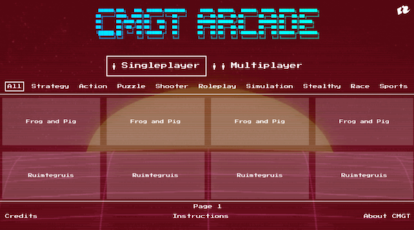

# Arcade Server

The Frontend for the [CMGT Arcade Machine](https://hr-cmgt.github.io/arcade-server/)



## Game requirements

- Resolution: 1440 x 900 (16:10)
- Audio: WAV or OGG files. Autoplay only works after a user interaction on the page!
- Support the Arcade stick and buttons with the [GamePad API](https://developer.mozilla.org/en-US/docs/Web/API/Gamepad_API/Using_the_Gamepad_API). [Typescript Example code here](https://github.com/HR-CMGT/arcade-server/dev/joystick.ts)
- The game needs to redirect back to [https://hr-cmgt.github.io/arcade-server/](https://hr-cmgt.github.io/arcade-server/) when buttons 5 and 6 are pressed!

## The interface

- [games.json](./docs/data/games.json) a JSON file with links to the github Page of game repositories, and genres.
- Grid page
- Controls explanation
- Redirects to Game pages

## Browser

The DOCS folder of this repository will be [served](https://hr-cmgt.github.io/arcade-server/) on the arcade machine at CMGT. The browser is
[NWJS](http://docs.nwjs.io/en/latest/For%20Users/Getting%20Started/#get-nwjs) in Kiosk Mode

## TODO

- improve paging (detect left right in game menu)
- select by criteria (players and genre)
- credits page
- instructions page
- about page
- grid selection code

## Nice to have

- Mobile view (just for showcase purposes)
- Open Unity games from NWJS menu
```
var exec = require('child_process').execFile;

exec('C:/asd/test.exe', function(err, data) {  
        console.log(err)
        console.log(data.toString());                       
});
```

## Credits

Many thanks to [Tim Borowy](https://github.com/TimBorowy) and [GrunkHead Dave](https://github.com/Grunkhead) for setting up the first iteration
